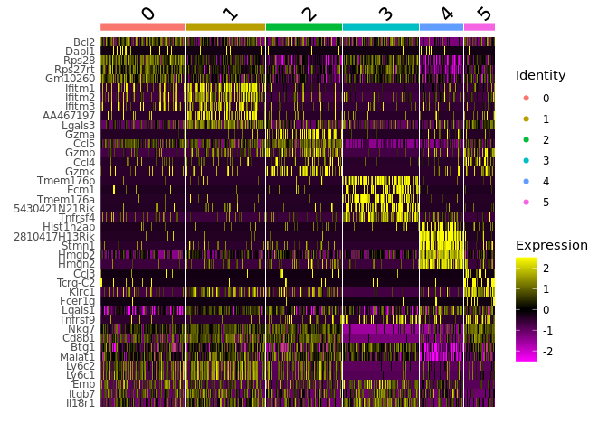
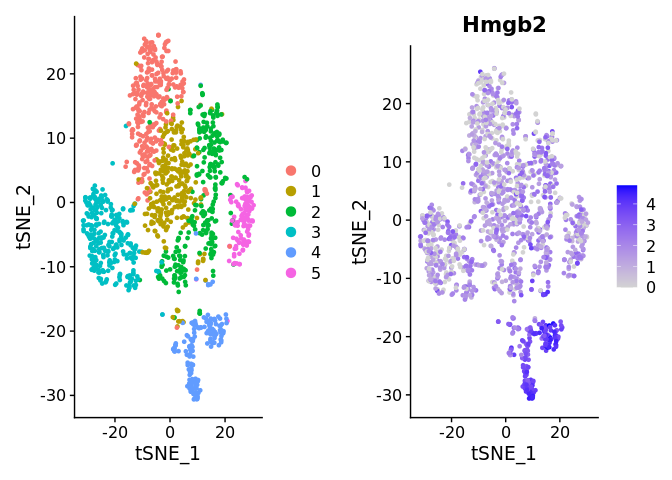
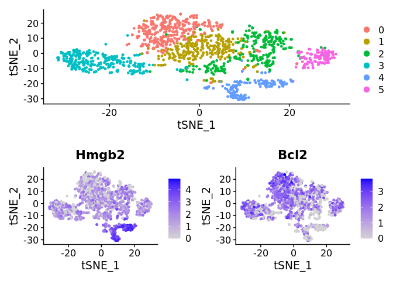
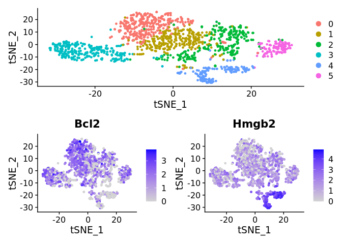
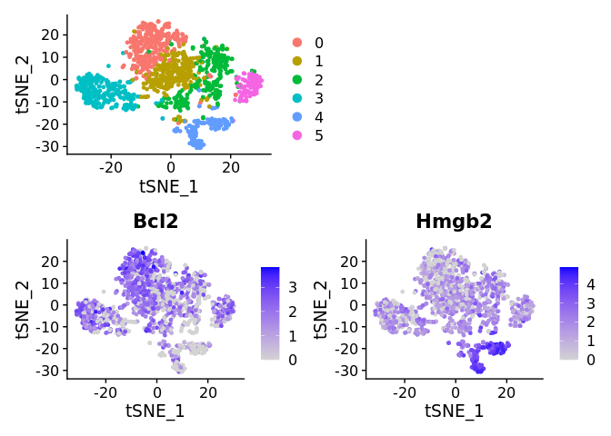
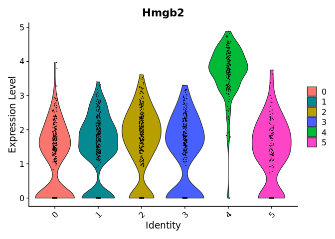
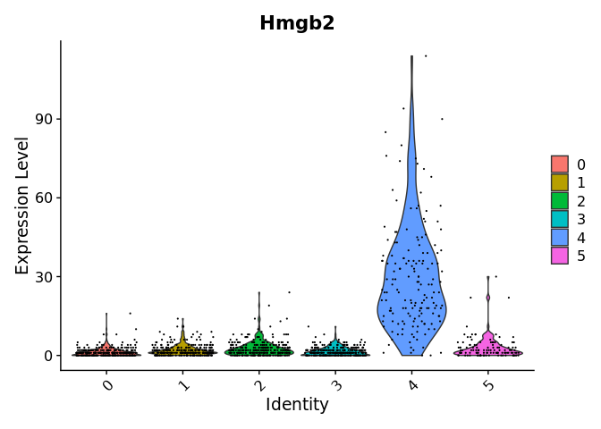

-   [0. Load data](#load-data)
-   [1. Identify DEGs between clusters](#identify-degs-between-clusters)
    -   [DE analysis for specific
        cluster](#de-analysis-for-specific-cluster)
    -   [DE Analysis for all clusters](#de-analysis-for-all-clusters)
-   [2. Redefining clusters](#redefining-clusters)
-   [3. Verify manuscript DE results](#verify-manuscript-de-results)
    -   [DE between p2 and p4](#de-between-p2-and-p4)

``` r
knitr::opts_chunk$set(echo = T, message = FALSE, warning = FALSE)
stdt <- date()

# Packages
library(tidyverse)
```

    ## Warning in system("timedatectl", intern = TRUE): running command 'timedatectl'
    ## had status 1

    ## ── Attaching packages ─────────────────────────────────────── tidyverse 1.3.1 ──

    ## ✔ ggplot2 3.3.6     ✔ purrr   0.3.4
    ## ✔ tibble  3.1.7     ✔ dplyr   1.0.9
    ## ✔ tidyr   1.2.0     ✔ stringr 1.4.0
    ## ✔ readr   2.1.2     ✔ forcats 0.5.1

    ## ── Conflicts ────────────────────────────────────────── tidyverse_conflicts() ──
    ## ✖ dplyr::filter() masks stats::filter()
    ## ✖ dplyr::lag()    masks stats::lag()

``` r
library(Seurat)
```

    ## Attaching SeuratObject

    ## Attaching sp

``` r
library(cowplot)
library(patchwork)
```

    ## 
    ## Attaching package: 'patchwork'

    ## The following object is masked from 'package:cowplot':
    ## 
    ##     align_plots

``` r
# Paths
wd <- "/hpc/group/chsi-mic-2022"
intermeddir <- file.path(wd, "intermed")
```

**Goal of this workshop:** Learn how to perform differential expression
(DE) between clusters

**What’s covered in this workshop:** - Identify Differentially Expressed
Genes (DEGs) between clusters - Re-name clusters - Verify manuscript DE
results

**Data source:** Christian et al. 2021 Cell Reports
(<https://doi.org/10.1016/j.celrep.2021.109118>)

Note that the Seurat - Guided Clustering Tutorial
(<https://satijalab.org/seurat/articles/pbmc3k_tutorial.html>) includes
a lot of overlapping information.

**METHOD DETAILS, Single-cell RNA-seq analysis, page e4**

-   Pre-processing: “Raw short reads were demultiplexed, filtering and
    mapped to mouse genome GRCm38/mm10 using cellranger v2.02.”

-   QC: “The gene count matrices from cellranger were subjected to
    quality control, pre-processing and clustering using the R Seurat
    2.3.4 package (Butler et al., 2018). Low-quality cells that had less
    than 200 expressed genes and more than 5% mitochondrial genes were
    filtered out.”

-   Analysis: “Gene counts were scaled to total gene expression and
    percentage of mitochondrial genes with a scaling factor of 10,000,
    and then log-transformed. The high dimensional data for each sample
    were reduced by PCA and t-Distributed Stochastics Neighbor Embedding
    (tSNE). We used the FindCluster function to group clusters in each
    sample with a resolution of 0.6. Differential expressed genes (DEGs)
    were identified using the Wilcoxon rank-sum test.”

## 0. Load data

This tutorial will be based on the pre-processed Seurat object used in
the tutorial on clustering and cell-type inference (see
clustering_annotation.Rmd).

``` r
infile <- file.path(intermeddir, "seulist-drc.rds")
tools::md5sum(infile)
```

    ## /hpc/group/chsi-mic-2022/intermed/seulist-drc.rds 
    ##                "6ba4e87021f43c5c4874cc8512453077"

``` r
seulist.drc <- readRDS(infile)
```

## 1. Identify DEGs between clusters

*METHOD DETAILS, Single-cell RNA-seq analysis, page 4e*: “Differentially
expressed genes (DEGs) were identified using the Wilcoxon rank-sum
test.”

This tutorial will be based on the Tem data set.

``` r
tem <- seulist.drc[["Tem"]]
tem@meta.data %>% head()
```

    ##                  orig.ident nCount_RNA nFeature_RNA percent.mt RNA_snn_res.0.6
    ## AAACCTGCAAGGTTCT        Tem       6011         1797  0.9316254               5
    ## AAACCTGCACGCGAAA        Tem       3740         1186  2.7005348               1
    ## AAACCTGGTATGGTTC        Tem       1861          776  2.4180548               1
    ## AAACCTGTCTGGTATG        Tem       2336          955  2.0547945               1
    ## AAACGGGCATGCCTAA        Tem       6249         1539  2.2083533               0
    ## AAACGGGGTCTGATTG        Tem       9313         2374  2.2549125               4
    ##                  seurat_clusters
    ## AAACCTGCAAGGTTCT               5
    ## AAACCTGCACGCGAAA               1
    ## AAACCTGGTATGGTTC               1
    ## AAACCTGTCTGGTATG               1
    ## AAACGGGCATGCCTAA               0
    ## AAACGGGGTCTGATTG               4

The DE analysis will used the inferred clustering column
seurat_clusters. Specifically, we will consider DE analysis between
cluster {0} and clusters {1,2,3,4,5}.

``` r
tem@meta.data %>%
  pull(seurat_clusters) %>%
  unique()
```

    ## [1] 5 1 0 4 3 2
    ## Levels: 0 1 2 3 4 5

The Seurat FindMarkers() function can be used to conduct differential
expression analysis between cluster (or group) variables in the meta
data slot of a Seurat object. For the purpose of trying to reproduce the
manuscript results, we will assume that the authors have used the
defaults. Here are a few default arguments to be aware of:

-   **min.pct = 0.1** : Do not test genes that make up fewer than 0.1
    fraction (10% ?) of the total reads in either of the populations
    tested. Meant to speed up the function by not testing genes that are
    very infrequently expressed. Default is 0.1

-   **max.cells.per.ident = Inf** : “This will downsample each identity
    class to have no more cells than whatever this is set to. While
    there is generally going to be a loss in power, the speed increases
    can be significant and the most highly differentially expressed
    features will likely still rise to the top”
    (<https://satijalab.org/seurat/articles/pbmc3k_tutorial.html>)

-   **logfc.threshold = 0.25** “Limit testing to genes which show, on
    average, at least X-fold difference (log-scale) between the two
    groups of cells. Default is 0.25. Increasing logfc.threshold speeds
    up the function, but can miss weaker signals.” (Seurat help)

-   **test.use = “wilcox** Denotes which test to use; see Seurat help
    for alternatives.

-   **min.cells.group = 3** “Minimum number of cells in one of the
    groups” (Seurat help)

-   **ident.2** “A second identity class for comparison; if NULL, use
    all other cells for comparison” (Seurat help)

### DE analysis for specific cluster

``` r
cluster0.markers <- FindMarkers(tem, ident.1 = 0) # min.pct = 0.1 by default
cluster0.markers %>%
  arrange(-avg_log2FC) %>%
  head(n = 5)
```

    ##                p_val avg_log2FC pct.1 pct.2    p_val_adj
    ## Bcl2    2.175929e-28  0.8085540 0.855 0.608 2.735360e-24
    ## Dapl1   3.665931e-09  0.6328763 0.126 0.039 4.608442e-05
    ## Rps28   3.679618e-70  0.5631877 1.000 0.999 4.625647e-66
    ## Rps27rt 8.884549e-46  0.5063820 1.000 0.996 1.116877e-41
    ## Gm10260 3.618803e-44  0.5046848 1.000 0.994 4.549197e-40

The seurat_clusters variable is the active ident in the Tem object. Had
it not, it would have to be set using the Seurat Ident() function

**Examine Wilcoxon Rank Sum test**

Next, we will attempt to reproduce the FindMarker() results for Bcl2
using standard R functions.

First we specify the gene of interest.

``` r
# Select the gene Bcl2
sel.gene <- "Bcl2"
```

Next, we subset the Tem object according to inferred cluster (0 vs
others):

``` r
# subset cells in cluster 0
tem.0 <- subset(x = tem, idents = "0")
ncol(x = tem.0) # 317 cells
```

    ## [1] 317

``` r
unique(Idents(tem.0)) # check that these are all from the 0 cluster
```

    ## [1] 0
    ## Levels: 0

``` r
# subset cells in any other cluster
tem.else <- subset(x = tem, idents = "0", invert = TRUE)
ncol(x = tem.else) # 1140 cells
```

    ## [1] 1140

``` r
unique(Idents(tem.else)) # check that these are all from clusters other than 0
```

    ## [1] 5 1 4 3 2
    ## Levels: 1 2 3 4 5

This step extracts the expression values from the two objects

``` r
# extract scaled expression values
expr.0 <- GetAssayData(object = tem.0, slot = "data")
expr.else <- GetAssayData(object = tem.else, slot = "data")
```

``` r
# Extract expression values for the gene Bcl2
expr.0.sel <- expr.0[rownames(expr.0) == sel.gene, ]
expr.else.sel <- expr.else[rownames(expr.else) == sel.gene, ]
length(expr.0.sel)
```

    ## [1] 317

``` r
length(expr.else.sel)
```

    ## [1] 1140

Now, we reproduce the the fractions of cells with expression for cluster
0 and other clusters, i.e., `pct.1` and `pct.2`,

``` r
pct.1 <- mean(expr.0.sel > 0)
pct.2 <- mean(expr.else.sel > 0)

pct.1
```

    ## [1] 0.8548896

``` r
pct.2
```

    ## [1] 0.6078947

Next, we reproduce the average log2 FC `avg_log2FC`,

``` r
avg.0 <- mean(expm1(expr.0.sel)) + 1
avg.else <- mean(expm1(expr.else.sel)) + 1
avg.log2FC <- log2(avg.0) - log2(avg.else)

avg.log2FC
```

    ## [1] 0.808554

Next, we generate the P-value using the R wilcox.test().

``` r
# Perform the Wilcoxon Rank Sum test
wilcox.test(
  x = expr.0.sel,
  y = expr.else.sel,
  alternative = "two.sided"
) -> wtest

wtest$p.value
```

    ## [1] 2.175929e-28

Next, we calculate the adjusted P-value using Bonferroni correction,

``` r
n.genes.tested <- nrow(tem)
min(wtest$p.value * n.genes.tested, 1)
```

    ## [1] 2.73536e-24

The results above match the values provided by FindMarker()

``` r
cluster0.markers %>%
  rownames_to_column(var = "gene_name") %>%
  filter(gene_name == sel.gene)
```

    ##   gene_name        p_val avg_log2FC pct.1 pct.2   p_val_adj
    ## 1      Bcl2 2.175929e-28   0.808554 0.855 0.608 2.73536e-24

``` r
# p-value = 2.175929e-28
```

Exercise: Repeat the last analysis for Nkg7

``` r
# Select the gene Nkg7
sel.gene <- "Nkg7"
```

``` r
# Extract expression values for the gene
expr.0.sel <- expr.0[rownames(expr.0) == sel.gene, ]
expr.else.sel <- expr.else[rownames(expr.else) == sel.gene, ]
length(expr.0.sel)
```

    ## [1] 317

``` r
length(expr.else.sel)
```

    ## [1] 1140

``` r
pct.1 <- mean(expr.0.sel > 0)
pct.2 <- mean(expr.else.sel > 0)

pct.1
```

    ## [1] 0.9242902

``` r
pct.2
```

    ## [1] 0.7157895

``` r
avg.0 <- mean(expm1(expr.0.sel)) + 1
avg.else <- mean(expm1(expr.else.sel)) + 1
avg.log2FC <- log2(avg.0) - log2(avg.else)

avg.log2FC
```

    ## [1] -0.2809875

``` r
# Perform the Wilcoxon Rank Sum test
wilcox.test(
  x = expr.0.sel,
  y = expr.else.sel,
  alternative = "two.sided"
) -> wtest

wtest$p.value
```

    ## [1] 0.5104688

``` r
n.genes.tested <- nrow(tem)
min(wtest$p.value * n.genes.tested, 1)
```

    ## [1] 1

``` r
cluster0.markers %>%
  rownames_to_column(var = "gene_name") %>%
  filter(gene_name == sel.gene)
```

    ##   gene_name     p_val avg_log2FC pct.1 pct.2 p_val_adj
    ## 1      Nkg7 0.5104688 -0.2809875 0.924 0.716         1

``` r
# p-value = 0.51
```

### DE Analysis for all clusters

The Seurat FindAllmarkers() function can be used to conducted DE
analysis for every cluster.

``` r
all.markers <- FindAllMarkers(tem)
```

Show the top 5 up-regulated (by FC) genes in each cluster

``` r
all.markers %>%
  group_by(cluster) %>%
  slice_max(n = 3, order_by = avg_log2FC) %>%
  arrange(cluster, -avg_log2FC)
```

    ## # A tibble: 18 × 7
    ## # Groups:   cluster [6]
    ##        p_val avg_log2FC pct.1 pct.2 p_val_adj cluster gene         
    ##        <dbl>      <dbl> <dbl> <dbl>     <dbl> <fct>   <chr>        
    ##  1 2.18e- 28      0.809 0.855 0.608 2.74e- 24 0       Bcl2         
    ##  2 3.67e-  9      0.633 0.126 0.039 4.61e-  5 0       Dapl1        
    ##  3 3.68e- 70      0.563 1     0.999 4.63e- 66 0       Rps28        
    ##  4 1.07e- 69      2.92  0.677 0.217 1.35e- 65 1       Ifitm1       
    ##  5 9.69e- 66      2.12  0.738 0.274 1.22e- 61 1       Ifitm2       
    ##  6 4.57e- 50      1.67  0.571 0.174 5.75e- 46 1       Ifitm3       
    ##  7 1.03e- 72      3.17  0.517 0.085 1.30e- 68 2       Gzma         
    ##  8 1.48e- 58      1.98  0.969 0.752 1.86e- 54 2       Ccl5         
    ##  9 4.01e- 43      1.90  0.692 0.306 5.04e- 39 2       Gzmb         
    ## 10 1.19e-156      2.55  0.711 0.053 1.49e-152 3       Tmem176b     
    ## 11 2.97e- 68      2.39  0.444 0.063 3.73e- 64 3       Ecm1         
    ## 12 8.58e-132      2.25  0.62  0.046 1.08e-127 3       Tmem176a     
    ## 13 1.12e- 65      4.23  0.58  0.093 1.41e- 61 4       Hist1h2ap    
    ## 14 8.88e-174      3.09  0.858 0.059 1.12e-169 4       2810417H13Rik
    ## 15 4.14e-148      3.00  0.914 0.114 5.21e-144 4       Stmn1        
    ## 16 4.12e- 16      2.36  0.509 0.201 5.18e- 12 5       Ccl4         
    ## 17 3.45e- 27      2.32  0.298 0.042 4.33e- 23 5       Ccl3         
    ## 18 1.25e- 95      1.94  0.544 0.03  1.57e- 91 5       Tcrg-C2

``` r
# note that this uses slice_max() and avg_log2FC is arranged from high to low with "-"
```

Show the top 5 down-regulated (by FC) genes in each cluster

``` r
all.markers %>%
  group_by(cluster) %>%
  slice_min(n = 3, order_by = avg_log2FC) %>%
  arrange(cluster, avg_log2FC)
```

    ## # A tibble: 18 × 7
    ## # Groups:   cluster [6]
    ##        p_val avg_log2FC pct.1 pct.2 p_val_adj cluster gene     
    ##        <dbl>      <dbl> <dbl> <dbl>     <dbl> <fct>   <chr>    
    ##  1 2.19e- 11      -2.43 0.047 0.204 2.75e-  7 0       Gzma     
    ##  2 2.42e-  5      -2.39 0.142 0.248 3.05e-  1 0       Ccl4     
    ##  3 1.31e-  6      -1.93 0.063 0.171 1.65e-  2 0       Hist1h2ap
    ##  4 1.76e-  6      -1.86 0.082 0.193 2.22e-  2 1       Gzma     
    ##  5 1.05e-  3      -1.81 0.088 0.163 1   e+  0 1       Hist1h2ap
    ##  6 2.10e-  9      -1.19 0.031 0.164 2.64e-  5 1       Ecm1     
    ##  7 1.92e-  6      -1.85 0.217 0.332 2.41e-  2 2       Ifitm1   
    ##  8 1.40e- 11      -1.41 0.206 0.407 1.75e-  7 2       Ifitm2   
    ##  9 1.24e- 12      -1.18 0.038 0.216 1.56e-  8 2       Tmem176b 
    ## 10 4.81e- 81      -5.22 0.454 0.877 6.04e- 77 3       Ccl5     
    ## 11 7.54e- 20      -3.49 0.095 0.361 9.48e- 16 3       Ifitm1   
    ## 12 1.20e-112      -3.43 0.165 0.905 1.51e-108 3       Nkg7     
    ## 13 1.45e-  4      -2.37 0.21  0.322 1   e+  0 4       Ifitm1   
    ## 14 3.88e- 17      -1.78 0.673 0.81  4.87e- 13 4       Ccl5     
    ## 15 8.65e- 30      -1.70 0.29  0.708 1.09e- 25 4       Bcl2     
    ## 16 1.10e- 11      -1.84 0.219 0.536 1.38e-  7 5       Ly6c2    
    ## 17 3.51e- 10      -1.73 0.211 0.489 4.41e-  6 5       Ly6c1    
    ## 18 5.67e- 17      -1.54 0.114 0.511 7.13e- 13 5       Emb

``` r
# note that this uses slice_min() and avg_log2FC is arranged from low to high
```

Exercise: How would you get the top down- or up-regulated genes
according to FC?

Visualize the top 5 up- and down-regulated genes in a heatmap

``` r
all.markers %>%
  group_by(cluster) %>%
  slice_max(n = 5, order_by = avg_log2FC) -> upGenes
all.markers %>%
  group_by(cluster) %>%
  slice_min(n = 5, order_by = avg_log2FC) -> downGenes
upGenes %>%
  bind_rows(downGenes) -> topGenes

DoHeatmap(tem, features = topGenes$gene)
```



``` r
# Clusters 0, 1, 2 correspond to p1?
# Cluster 3 corresponds to p2?
# Cluster 4 corresponds to p3?
# Cluster 5 corresponds to p4?
```

Investigate a specific gene by overlaying gene expression on top of the
tSNE plot as in the Fig2 B-D plots (page 5).

Example 1:

``` r
# remember this visualization tool from above too
plot_grid(
  DimPlot(tem, reduction = "tsne"),
  FeaturePlot(tem, features = c("Hmgb2")),
  nrow = 1
)
```


Example 2 (Two genes):

``` r
# remember this visualization tool from above too
plot_grid(
  DimPlot(tem, reduction = "tsne"),
  FeaturePlot(tem, features = c("Hmgb2", "Bcl2")),
  nrow = 2
)
```


Example 3 (Use patchwork composition)

``` r
DimPlot(tem, reduction = "tsne")  /
  (FeaturePlot(tem, features = c("Bcl2"))| FeaturePlot(tem, features = c("Hmgb2")))
```



Example 3 (Use patchwork composition with spacer)

``` r
(DimPlot(tem, reduction = "tsne") | plot_spacer()) /
  (FeaturePlot(tem, features = c("Bcl2"))| FeaturePlot(tem, features = c("Hmgb2")))
```



Investigate a specific gene by generating violin plots. By default, the
“expression level” is based on values in the “data” slot. Alternatively,
you can plot counts from the “counts” slot instead.

``` r
VlnPlot(tem, features = c("Hmgb2"), split.by = "seurat_clusters")
```



``` r
# you can plot raw counts as well
VlnPlot(tem, features = c("Hmgb2"), slot = "counts")
```



``` r
VlnPlot(tem, features = c("Hmgb2"), slot = "counts", log = TRUE)
```


## 2. Redefining clusters

Next, we attempt to redefine clusters based on biomarkers and study aims
(Fig 2)

Our understanding (see *RESULTS, scRNA-seq dissects intratumoral TEff/EM
heterogeneity, page 4-5*) is that the the biomarkers were defined as
follows

p1 = Clusters 0, 1, 2 p2 = Cluster 3 p3 = Cluster 4 p4 = Cluster 5

We can add this information to the tem Seurat object metadata

``` r
new.cluster.ids <- c(
  "p1", "p1", "p1",
  "p2",
  "p3",
  "p4"
)
levels(tem)
```

    ## [1] "0" "1" "2" "3" "4" "5"

``` r
names(new.cluster.ids) <- levels(tem)
tem <- RenameIdents(tem, new.cluster.ids)
```

We can verify the

``` r
table(orig = tem@meta.data$seurat_clusters, new = Idents(tem))
```

    ##     new
    ## orig  p1  p2  p3  p4
    ##    0 317   0   0   0
    ##    1 294   0   0   0
    ##    2 286   0   0   0
    ##    3   0 284   0   0
    ##    4   0   0 162   0
    ##    5   0   0   0 114

Based on these updated classifications, we can re-annotate the tSNE plot

``` r
DimPlot(tem, reduction = "tsne", label = TRUE, pt.size = 0.5)
```


## 3. Verify manuscript DE results

### DE between p2 and p4

*RESULTS, scRNA-seq dissects intratumoral TEff/EM heterogeneity, page
4-5*? “Comparing p2 to p4, the density of Runx3- and Id2-expressing
cells was slightly lower in p2. …This was accompanied by an opposite
pattern of Id3, a transcription factor whose expression is crucial for
effector memory development (Yang et al., 2011), which is absent in p4
(Figure 2C).”

Now that we have defined clusters p2 and p4, we can perform DE analyses
between these cell populations as in the manuscript.

``` r
p4v2markers <- FindMarkers(tem, ident.1 = "p4", ident.2 = "p2", min.pct = 0.25)
```

Examine up-regulated genes in p4 as compared to p2

``` r
p4v2markers %>%
  slice_max(n = 5, order_by = avg_log2FC) %>%
  arrange(-avg_log2FC) -> upGenes
upGenes
```

    ##              p_val avg_log2FC pct.1 pct.2    p_val_adj
    ## Ccl4  5.609616e-27   4.536436 0.509 0.056 7.051849e-23
    ## Ccl5  3.026007e-26   4.296344 0.912 0.454 3.803994e-22
    ## Nkg7  8.890317e-68   4.180627 1.000 0.165 1.117602e-63
    ## Klrc1 1.905160e-72   3.487166 0.921 0.025 2.394977e-68
    ## Cd8b1 2.345653e-69   3.284825 0.965 0.077 2.948720e-65

Examine down-regulated genes in p4 as compared to p2

``` r
p4v2markers %>%
  slice_min(n = 5, order_by = avg_log2FC) %>%
  arrange(avg_log2FC) -> downGenes
downGenes
```

    ##                      p_val avg_log2FC pct.1 pct.2    p_val_adj
    ## Tmem176b      2.523090e-31  -2.738166 0.026 0.711 3.171776e-27
    ## Ecm1          5.138250e-13  -2.473402 0.088 0.444 6.459294e-09
    ## Tmem176a      1.071210e-25  -2.401155 0.018 0.620 1.346618e-21
    ## 5430421N21Rik 5.562011e-16  -2.269368 0.061 0.479 6.992004e-12
    ## Emb           2.325136e-24  -2.195173 0.114 0.662 2.922929e-20

*RESULTS, CXCR6 expression defines a unique subpopulation of TEff/EMs,
page 9* “The elevated Cxcr6 expression in p4 was associated with
enhanced Pdcd1 and reduced IL7r expression, in direct opposition to p2
(Figure 5B).”

``` r
p4v2markers %>%
  rownames_to_column(var = "gene") %>%
  filter(gene == "Pdcd1")
```

    ##    gene        p_val avg_log2FC pct.1 pct.2    p_val_adj
    ## 1 Pdcd1 1.595608e-45   1.888853 0.807 0.088 2.005839e-41

``` r
p4v2markers %>%
  rownames_to_column(var = "gene") %>%
  filter(gene %in% c("Il7r", "Il18r1"))
```

    ##     gene        p_val avg_log2FC pct.1 pct.2    p_val_adj
    ## 1 Il18r1 1.985300e-28  -2.118871 0.386 0.845 2.495720e-24
    ## 2   Il7r 1.512968e-24  -2.024693 0.325 0.757 1.901952e-20

*RESULTS, CXCR6 expression defines a unique subpopulation of TEff/EMs,
page 9* “We virtually sorted out these two populations of cells \[p2 vs
p4\] and compared their gene expression at the transcriptomic level
(Figure 5C). The differential expression of Nkg7 and Klrc/d family
members suggested that these are highly active effector T cells, as seen
in the high expression of effector molecules such as Gzmb.” And from Fig
5 legend: “T cell activation markers Gzmb, Klrc1/2, and Klrd1 are
upregulated in TEFF/TEM p4”.

``` r
p4v2markers %>%
  rownames_to_column(var = "gene") %>%
  filter(gene %in% c("Gzmb", "Klrc1", "Klrc2", "Klrd1"))
```

    ##    gene        p_val avg_log2FC pct.1 pct.2    p_val_adj
    ## 1 Klrc1 1.905160e-72   3.487166 0.921 0.025 2.394977e-68
    ## 2 Klrd1 1.196772e-67   3.180395 0.939 0.060 1.504462e-63
    ## 3 Klrc2 2.279601e-58   2.176122 0.772 0.011 2.865687e-54
    ## 4  Gzmb 3.287915e-41   3.081300 0.693 0.067 4.133238e-37

#### Additional results statements to evaluate using DE

*RESULTS, scRNA-seq dissects intratumoral TEff/EM heterogeneity, page
4-5*

-   “The effector molecules Ifng and GzmB were highly expressed in p4,
    had heterogeneous expression in p1 and p3, but were largely absent
    from p2. Similar expression patterns were applied to well-known
    effector surface markers for cytolytic T cells such as Klrc1 and
    Nkg7 (Figure 2B).”
-   “All four subsets highly expressed the transcription factor Runx3…,
    as well as Id2…”
-   “Bcl2, a transcription factor for T cell survival in the effector
    and memory phases, was abundant in most sorted TEff/EM populations
    except p3.”
-   “After assessing the cell-cycle programs, we determined that p3 was
    a highly proliferative subset, as made evident by the expression of
    genes restrictively expressed in S and M phases, such as Ccnb2,
    Cdk1, and Mki67 (Figure 2D).

*RESULTS, Tumor and distant mucosa TRMs comprise two distinct
populations that resemble either TEMs or TCMs, page 5-6*

-   “As expected, the tumor and distant mucosa TRM populations showed
    high expression of Itgae (CD103) and low expression of S1PR1, con-
    firming their tendency to reside within the tissue (Figure S4).”
-   “Notably, the binary expression of Lgals3 (galectin-3) could
    distinguish TEMs (p1 of TEff/EM) from TCMs.”

*RESULTS, CXCR6 expression defines a unique subpopulation of TEff/EMs,
page 9*

-   ” Among all of the TEff/EM populations, S1pr1 expression was
    silenced in TEff/EM p4, suggesting that this may be a population
    that lacks the potential to egress.”

-   “In p4, compared to other chemokine receptors, Cxcr6 was highly
    expressed; compared to the other 3 populations, p4 was the only
    population that preferentially upregulated Cxcr6 (Figure 5A).”

-   “…However, for T cells in TEff/EM p2, we found that the upregulation
    of IL7r was associated with IL18r1 (Figure 5C).

-   “This analysis illustrated that these CXCR6+ effector cells were
    quite unique: on the one hand, they could be labeled as terminally
    exhausted cells (Wherry et al., 2007) based on their elevated
    expression of Pdcd1, Nr4a1 (Liu et al., 2019), Lag3, and Havcr2
    (Tim-3)..” And from Fig 5 legend: “Classical exhaustion markers
    Nr4a1, Lag3, and Havcr2 were upregulated in the tumor TEff/EM p4
    population.”

``` r
sessionInfo()
```

    ## R version 4.2.0 (2022-04-22)
    ## Platform: x86_64-pc-linux-gnu (64-bit)
    ## Running under: Ubuntu 20.04.4 LTS
    ## 
    ## Matrix products: default
    ## BLAS:   /usr/lib/x86_64-linux-gnu/blas/libblas.so.3.9.0
    ## LAPACK: /usr/lib/x86_64-linux-gnu/lapack/liblapack.so.3.9.0
    ## 
    ## locale:
    ##  [1] LC_CTYPE=en_US.UTF-8       LC_NUMERIC=C              
    ##  [3] LC_TIME=en_US.UTF-8        LC_COLLATE=en_US.UTF-8    
    ##  [5] LC_MONETARY=en_US.UTF-8    LC_MESSAGES=en_US.UTF-8   
    ##  [7] LC_PAPER=en_US.UTF-8       LC_NAME=C                 
    ##  [9] LC_ADDRESS=C               LC_TELEPHONE=C            
    ## [11] LC_MEASUREMENT=en_US.UTF-8 LC_IDENTIFICATION=C       
    ## 
    ## attached base packages:
    ## [1] stats     graphics  grDevices utils     datasets  methods   base     
    ## 
    ## other attached packages:
    ##  [1] patchwork_1.1.1    cowplot_1.1.1      sp_1.4-7           SeuratObject_4.1.0
    ##  [5] Seurat_4.1.1.9001  forcats_0.5.1      stringr_1.4.0      dplyr_1.0.9       
    ##  [9] purrr_0.3.4        readr_2.1.2        tidyr_1.2.0        tibble_3.1.7      
    ## [13] ggplot2_3.3.6      tidyverse_1.3.1   
    ## 
    ## loaded via a namespace (and not attached):
    ##   [1] readxl_1.4.0          backports_1.4.1       plyr_1.8.7           
    ##   [4] igraph_1.3.1          lazyeval_0.2.2        splines_4.2.0        
    ##   [7] listenv_0.8.0         scattermore_0.8       digest_0.6.29        
    ##  [10] htmltools_0.5.2       fansi_1.0.3           magrittr_2.0.3       
    ##  [13] tensor_1.5            cluster_2.1.3         ROCR_1.0-11          
    ##  [16] tzdb_0.3.0            limma_3.52.1          globals_0.15.0       
    ##  [19] modelr_0.1.8          matrixStats_0.62.0    spatstat.sparse_2.1-1
    ##  [22] colorspace_2.0-3      rvest_1.0.2           ggrepel_0.9.1        
    ##  [25] haven_2.5.0           xfun_0.31             crayon_1.5.1         
    ##  [28] jsonlite_1.8.0        progressr_0.10.1      spatstat.data_2.2-0  
    ##  [31] survival_3.2-13       zoo_1.8-10            glue_1.6.2           
    ##  [34] polyclip_1.10-0       gtable_0.3.0          leiden_0.4.2         
    ##  [37] future.apply_1.9.0    abind_1.4-5           scales_1.2.0         
    ##  [40] DBI_1.1.2             spatstat.random_2.2-0 miniUI_0.1.1.1       
    ##  [43] Rcpp_1.0.8.3          viridisLite_0.4.0     xtable_1.8-4         
    ##  [46] reticulate_1.25       spatstat.core_2.4-4   htmlwidgets_1.5.4    
    ##  [49] httr_1.4.3            RColorBrewer_1.1-3    ellipsis_0.3.2       
    ##  [52] ica_1.0-2             pkgconfig_2.0.3       farver_2.1.0         
    ##  [55] uwot_0.1.11           dbplyr_2.1.1          deldir_1.0-6         
    ##  [58] utf8_1.2.2            tidyselect_1.1.2      labeling_0.4.2       
    ##  [61] rlang_1.0.2           reshape2_1.4.4        later_1.3.0          
    ##  [64] munsell_0.5.0         cellranger_1.1.0      tools_4.2.0          
    ##  [67] cli_3.3.0             generics_0.1.2        broom_0.8.0          
    ##  [70] ggridges_0.5.3        evaluate_0.15         fastmap_1.1.0        
    ##  [73] yaml_2.3.5            goftest_1.2-3         knitr_1.39           
    ##  [76] fs_1.5.2              fitdistrplus_1.1-8    RANN_2.6.1           
    ##  [79] pbapply_1.5-0         future_1.26.1         nlme_3.1-157         
    ##  [82] mime_0.12             ggrastr_1.0.1         xml2_1.3.3           
    ##  [85] compiler_4.2.0        rstudioapi_0.13       beeswarm_0.4.0       
    ##  [88] plotly_4.10.0         png_0.1-7             spatstat.utils_2.3-1 
    ##  [91] reprex_2.0.1          stringi_1.7.6         highr_0.9            
    ##  [94] rgeos_0.5-9           lattice_0.20-45       Matrix_1.4-1         
    ##  [97] vctrs_0.4.1           pillar_1.7.0          lifecycle_1.0.1      
    ## [100] spatstat.geom_2.4-0   lmtest_0.9-40         RcppAnnoy_0.0.19     
    ## [103] data.table_1.14.2     irlba_2.3.5           httpuv_1.6.5         
    ## [106] R6_2.5.1              promises_1.2.0.1      KernSmooth_2.23-20   
    ## [109] gridExtra_2.3         vipor_0.4.5           parallelly_1.31.1    
    ## [112] codetools_0.2-18      MASS_7.3-57           assertthat_0.2.1     
    ## [115] withr_2.5.0           sctransform_0.3.3     mgcv_1.8-40          
    ## [118] parallel_4.2.0        hms_1.1.1             grid_4.2.0           
    ## [121] rpart_4.1.16          rmarkdown_2.14        Rtsne_0.16           
    ## [124] shiny_1.7.1           lubridate_1.8.0       ggbeeswarm_0.6.0
